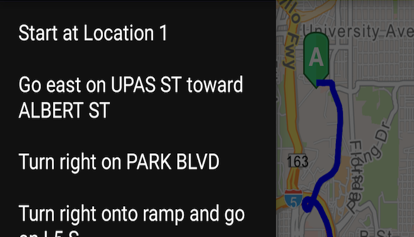

# Find Route
Get a route between two locations.

# How to use the sample
For simplicity the sample comes with Source and Destination stops. You can click on the Navigation  Floating Action Button to get a route between the stops. Once a route is generated, the `DrawerLayout` is unlocked and you can view the direction maneuver as a list.

# How it works
The sample creates a `RouteTask` from a URL and uses default `RouteParameters` from the `RouteTask` service to set up the 'stops'. In order to get detailed driving directions, `setReturnDirections` is set true in the parameters. `RouteTask.solveAsync` is used to solve for route. The `RouteResult` is then used to create the route graphics and `getDirectionManeuvers()` on route result returns step-by-step direction list which is populated in the `ListView`.

# Relevant API
* DirectionManeuver
* Route
* RouteParameters
* RouteResult
* RouteTask
* ailaname cm  password cmcontainer
#### Tags
Routing and Logistics

问题：
登录异常时比如账号密码错误 data数据本身是对象但返回 "" 造成解析异常无法造成拿到msg 提示

路线查询 哪个是路线名称
        * siteName :
         * address :

         array 经纬度 里前后 哪个是经度 和 纬度

         03-31 23:05:47.461 21587-21587/com.esri.arcgisruntime.container.monitoring E/params: MD5加密前 ==  codeCIXU3197513endtime2019-03-31page1starttime2018-03-31type21554044747461d6325521c0bc49399f471bd85f2d2d15
         03-31 23:05:47.461 21587-21587/com.esri.arcgisruntime.container.monitoring E/MD5Utils: ?code=CIXU3197513&sign=f481a02df62e7e543066ec0a5642566c&endtime=2019-03-31&keyId=6df5fe45dca442b090a80b83445d1f78&starttime=2018-03-31&page=1&time=1554044747461&type=2
         03-31 23:05:47.462 21587-21587/com.esri.arcgisruntime.container.monitoring E/params: key: = code  value  = CIXU3197513
                                                                                              key: = sign  value  = f481a02df62e7e543066ec0a5642566c
                                                                                              key: = endtime  value  = 2019-03-31
                                                                                              key: = keyId  value  = 6df5fe45dca442b090a80b83445d1f78
                                                                                              key: = starttime  value  = 2018-03-31
                                                                                              key: = page  value  = 1
                                                                                              key: = time  value  = 1554044747461
                                                                                              key: = type  value  = 2
         03-31 23:05:47.490 21587-21904/com.esri.arcgisruntime.container.monitoring E/CustomerOkHttpClient: Request: http://220.194.42.2:8803/appServer/servlet/queryBillList.json
         03-31 23:05:48.561 21587-21904/com.esri.arcgisruntime.container.monitoring E/CustomerOkHttpClient: Access Server in 1028.0ms ,Response: {"msg":"类型输入不合法！！","status":"603"}
         03-31 23:05:48.561 21587-21904/com.esri.arcgisruntime.container.monitoring E/CustomerOkHttpClient: 返回 == http://220.194.42.2:8803/appServer/servlet/queryBillList.json

